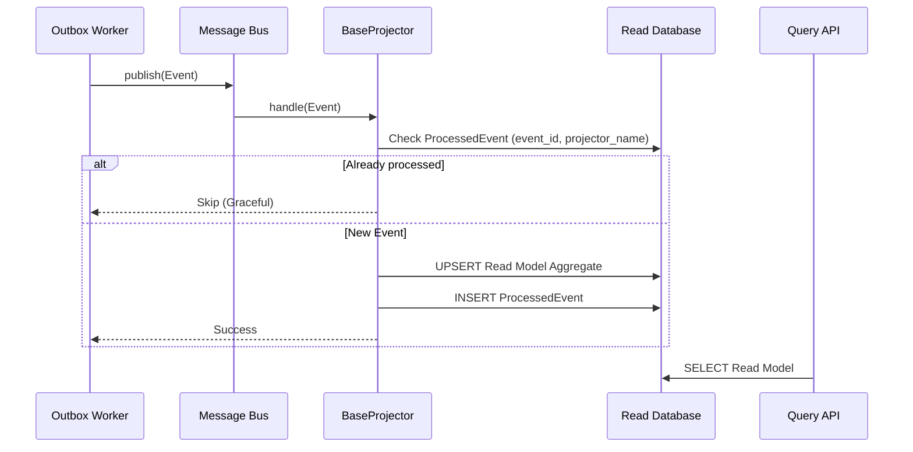

# CQRS Read Model & Projection

Dalam Event-Driven Architecture (EDA), memisahkan tabel baca (Read Model) dan tabel tulis (Write Model/OLTP) dikenal sebagai **CQRS (Command Query Responsibility Segregation)**.

## 1. Arsitektur CQRS
Sistem Enterprise membutuhkan kecepatan baca tanpa membebani tabel transaksional yang sering di-lock dan penuh (misal: menghitung omzet dari jutaan invoice).
Solusinya:
- **Write Model**: `SalesTransaction`, `Visit`, dll (Telah diurus di Sprint 1-10.2).
- **Read Model**: `DailySalesSummary`, `CustomerLedgerSummary`, `ProductSalesSummary`, `SalesPerformanceSummary` (Dibangun di Sprint 10.3).

## 2. Event Flow & Projection
- Setelah **Command** berhasil dieksekusi (contoh: Konfirmasi Invoice), aplikasi akan menghasilkan **Domain Event** (`InvoiceConfirmedEvent`) melalui *Transactional Outbox*.
- Pekerja *background* (`OutboxRelayWorker`) akan mengirim event ini ke *Message Bus*.
- **Projector** (sebagai *Subscriber* di *Event Bus*) akan menangkap event dan memperbarui tabel *Read Model*.

Contoh: `InvoiceConfirmedEvent` ditangkap oleh 4 Projector sekaligus:
- `SalesSummaryProjector` -> Update `DailySalesSummary` (omzet).
- `CustomerLedgerProjector` -> Update `CustomerLedgerSummary` (piutang).
- `ProductSalesProjector` -> Update `ProductSalesSummary` (terlaris).
- `SalesPerformanceProjector` -> Update `SalesPerformanceSummary` (KPI Sales).

## 3. Projection Checkpoint & Idempotency
Penting untuk memastikan bahwa *Read Model* tidak menggandakan hitungan jika *Worker* mempublikasikan event yang sama dua kali (ingat: Outbox menjamin *At-Least-Once Delivery*).
Sistem ini menggunakan teknik **Idempotency berbasis Event-Tracking** menggunakan tabel `ProcessedEvent`.
- **Primary Key Unik**: Kombinasi `[event_id, projector_name]`.
- Setiap projector turunan `BaseProjector` akan otomatis memeriksa tabel ini di dalam satu blok transaksi database *Prisma* saat memperbarui agregat (UPSERT).
- Jika rekaman `ProcessedEvent` sudah ada, pemrosesan akan dilewati dengan status log `Skipping`.

## 4. Replay Strategy
Jika bisnis meminta metrik baru (misalnya tabel `RegionalSalesSummary`), Anda bisa:
1. Menambahkan skema tabel baru di basis data.
2. Membuat `RegionalSalesProjector`.
3. Melakukan **Replay** dengan mengambil semua event dari tabel `OutboxEvent` (menggunakan *script* *bootstrapper* khusus di masa mendatang) dan meneruskannya ke Projector baru tersebut secara *stream*.
4. *ProcessedEvent* akan secara otomatis terbuat untuk Projector baru tersebut.

## 5. Sequence Diagram

## 6. Cara Menambah Projection Baru
- Definisikan tabel baru di `prisma/schema.prisma`.
- Buat *Class* turunan `BaseProjector`.
- Daftarkan `Event` yang ingin didengarkan pada metode `handles()`.
- Tulis logika `UPSERT` di `project(event, tx)`.
- Daftarkan proyektor di *Event Bus* (`app.js`).
- Buat Repositori (`src/repositories/read/`) dan API Route/Controller secara *Read-Only*.
