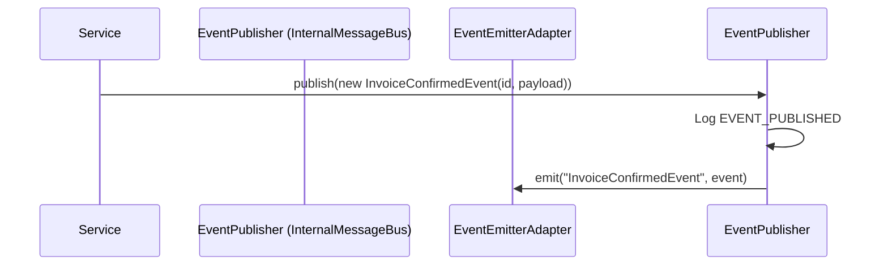
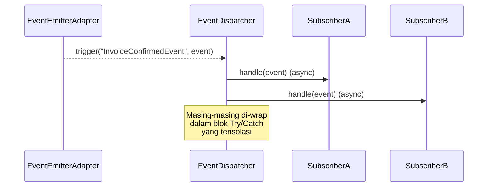

# Domain Events Infrastructure

Sistem Konsinyasi Minuman menggunakan Event-Driven Architecture (EDA) internal untuk mendistribusikan notifikasi perubahan *state* secara *asynchronous* tanpa merusak aliran utama bisnis (Sprint 1-9).

## 1. Tujuan Domain Events
- **Decoupling**: Memisahkan logika inti domain dari tugas-tugas sampingan seperti notifikasi, pencatatan log (audit), dan pelaporan.
- **Skalabilitas**: Proses yang berat (seperti pembuatan PDF atau sinkronisasi dengan *mobile*) dapat dipindahkan ke latar belakang.
- **Isolasi Kegagalan**: Kegagalan pada saat memproses notifikasi (misalnya WhatsApp API down) tidak akan menggagalkan transaksi penjualan atau pembayaran itu sendiri.

## 2. Flow Publish
Ketika terjadi perubahan signifikan di dalam sistem, layer *Application/Service* mempublikasikan *event*.



## 3. Flow Subscriber
Dispatcher menerima *event* dari *adapter* dan mendistribusikannya ke seluruh *subscriber* yang relevan.



## 4. Cara Membuat Event Baru
1. Buat *class* baru di `src/domain/events/`.
2. Pastikan mewarisi `DomainEvent`.
3. Akhiri nama dengan `Event` (contoh: `StockTransferredEvent`).
4. Panggil `super(aggregateId, aggregateType, payload, metadata, version)` dengan `version` default `1`.

```javascript
const DomainEvent = require('./DomainEvent');

class StockTransferredEvent extends DomainEvent {
  constructor(transferId, payload, metadata = {}) {
    super(transferId, 'StockTransfer', payload, metadata, 1);
  }
}
```

## 5. Cara Membuat Subscriber Baru
1. Buat *class* baru di `src/infrastructure/events/subscribers/`.
2. Pastikan mewarisi `EventSubscriber`.
3. Implementasikan metode `handles()` untuk mengembalikan sekumpulan *Event Classes*.
4. Implementasikan `handle(event)`.

```javascript
const EventSubscriber = require('./EventSubscriber');
const StockTransferredEvent = require('../../../domain/events/StockTransferredEvent');

class WarehouseSyncSubscriber extends EventSubscriber {
  handles() {
    return [StockTransferredEvent];
  }

  async handle(event) {
    console.log(`[WarehouseSync] Menyelaraskan transfer ${event.aggregateId}...`);
  }
}
```
5. Daftarkan *subscriber* di `src/app.js`:
   `eventBus.register(new WarehouseSyncSubscriber());`

## 6. Best Practices
1. **Append-Only / Immutable**: Jangan pernah mencoba memodifikasi isi objek `event` di dalam *subscriber*. Objek tersebut telah dikenai fungsi `deepFreeze`.
2. **Idempotency**: Pastikan *subscriber* aman untuk dijalankan ulang jika diperlukan.
3. **Keep it Fast**: *Subscriber* internal berjalan dalam *Node.js event loop*. Jika tugas *subscriber* terlalu lambat, distribusikan lagi ke antrean pihak ketiga (*Queue* eksternal seperti BullMQ/Redis) di masa mendatang.
