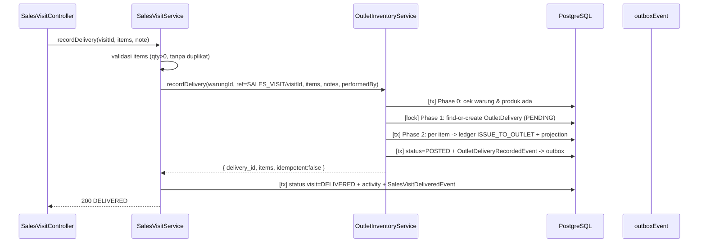

# Outlet Inventory — Delivery ke Stok Outlet (Sprint 11.1A)

Perpanjangan **additif** dari bounded context *Outlet Inventory* (11.0D) yang memperkenalkan
public API baru `OutletInventoryService.recordDelivery()` untuk memposting pengiriman
(delivery) ke stok outlet. Dipicu dari *Sales Visit* (11.0E) dan dirancang agar dapat
dipakai ulang oleh alur pengiriman lain (mis. dropship/warehouse) tanpa mengubah aturan
stok yang sudah ada.

## 1. Posisi di Arsitektur

```
11.0E Sales Visit (orchestrator)
   └─ POST :id/delivery ──► OutletInventoryService.recordDelivery()   (11.1A public API)
                              └─ Ledger ISSUE_TO_OUTLET (source of truth)
                              └─ Projection  (current_stock / total_refill)
                              └─ outbox      OutletDeliveryRecordedEvent
```

- Aturan stok tetap berada di bounded context *Outlet Inventory*.
- Sales Visit **tidak** menulis langsung ke tabel `OutletStock*`; ia hanya men-delegasikan
  ke public API `recordDelivery` (pola yang sama dengan `recordStockCount` 11.0D).
- Tidak ada perubahan terhadap `MovementType` (`ISSUE_TO_OUTLET` sudah ada sejak 11.0D)
  maupun tabel stok 11.0D yang sudah dipakai — semua perubahan bersifat menambah tabel baru.

## 2. Model Data

### Enum `OutletDeliveryStatus`

| Nilai | Arti |
| --- | --- |
| `PENDING` | Dokumen dibuat, belum diposting. |
| `POSTED` | Ledger + projection tertulis, `posted_at` terisi. |
| `FAILED` | Posting gagal (transient), `error_message` terisi; boleh dicoba ulang. |

### `OutletDelivery` (+ `OutletDeliveryItem`)

Kolom kunci:

- `reference_type` / `reference_id` — kunci idempotensi, `@@unique([reference_type, reference_id])`.
  `reference_id` bertipe `String` agar mendukung nomor order alfanumerik (mis. `ORD-001`).
- `status` default `PENDING`; `posted_at`, `error_message` untuk observabilitas.
- `items` → `OutletDeliveryItem(product_id, quantity)` di-*cascade*.

### Perubahan kecil pada `OutletStockLedger`

- Kolom `notes` (String?) ditambahkan untuk mencatat catatan delivery. Kolom lain tidak
  diubah; `reference_type`/`reference_id` tetap mengikuti konvensi 11.0D
  (`reference_id` **Int** → hanya `reference_id` numerik yang terisi, lihat §4).

## 3. Algoritma `recordDelivery`

Public API: `recordDelivery({ warungId, deliveryDate, referenceType, referenceId, performedBy, notes, items })`.

```
Phase 0  Validasi prasyarat (transaksi baca, TANPA persistensi)
         - warung harus ada           -> WARUNG_NOT_FOUND
         - semua produk harus ada     -> PRODUCT_NOT_FOUND
         - validasi entitas           -> 422 (qty integer > 0, tanpa duplikat produk)

Phase 1  Idempotensi (di dalam _withWarungLock)
         - cari dokumen oleh (reference_type, reference_id)
         - belum ada      -> buat status PENDING
         - POSTED         -> kembalikan hasil lama (idempotent: true)
         - PENDING/FAILED -> lanjut post ulang (retry)

Phase 2  Posting (SATU transaksi)
         - per item: cek produk ada
                     ledger ISSUE_TO_OUTLET (qty_before/qty_change/qty_after,
                                             reference, notes, created_by)
                     projection applyDelivery (current_stock + total_refill + version,
                                               buat baris bila belum ada)
         - status -> POSTED (posted_at, error_message = null)
         - emit OutletDeliveryRecordedEvent (transactional outbox)
         - error? status -> FAILED (error_message, max 500 char), lempar ulang.
```

Titik penting:

- **Atomic validation** (Phase 0) memastikan produk yang tidak dikenal ditolak **sebelum**
  dokumen delivery dibuat — tidak ada baris `OutletDelivery`/`OutletStockLedger` sebagian.
- **Idempotensi**: pemanggilan ulang dengan `(reference_type, reference_id)` yang sama
  tidak menggandakan stok. Hasil POSTED dikembalikan apa adanya (`idempotent: true`);
  retry hanya diizinkan untuk `PENDING`/`FAILED` (`RETRYABLE_STATUSES`).
- **Atomicity** (Phase 2): ledger, projection, status `POSTED`, dan outbox event commit
  bersama; kegagalan menandai `FAILED` tanpa ledger parsial.
- **Source of truth** tetap ledger; retry memosting ulang item dari **dokumen** tersimpan,
  bukan dari payload permintaan ulang (dokumen adalah otoritas).

Return shape:

```json
{
  "delivery_id": 7,
  "status": "POSTED",
  "reference_type": "SALES_VISIT",
  "reference_id": "94",
  "delivery_date": "2026-08-07T00:00:00.000Z",
  "items": [{ "product_id": 12, "qty_before": 0, "qty_change": 5, "qty_after": 5, "version": 1 }],
  "idempotent": false
}
```

## 4. Pemetaan `reference_id` (String -> Int)

`OutletStockLedger.reference_id` adalah kolom **Int** (konvensi 11.0D). `reference_id`
dokumen delivery bertipe **String** bebas. Karena itu hanya nilai numerik murni yang
dipetakan ke kolom tersebut (`_parseIntOrNull`); selain itu `null`. Untuk integrasi
Sales Visit (`referenceType = SALES_VISIT`) nilai numerik ID kunjungan tersimpan lengkap;
`visit_id` di event mengikuti aturan yang sama.

## 5. Projection (Read Model)

- `ISSUE_TO_OUTLET` sekarang diperlakukan sebagai **refill** oleh
  `OutletInventoryProjector` (kenaikan `current_stock` + `total_refill`) — selaras dengan
  penulisan sinkron `applyDelivery`, sehingga hasil *reconcile* dari ledger sama dengan
  hasil penulisan langsung.
- `applyDelivery` menaikkan `version` untuk optimistic concurrency (pola sama dengan
  `recordStockCount` 11.0D) dan membuat baris projection bila belum ada (produk yang baru
  pertama kali ter-deliver).

## 6. Domain Event `OutletDeliveryRecordedEvent`

Payload: `deliveryId`, `outletId`, `warungId`, `visitId` (hanya bila
`referenceType=SALES_VISIT` dan `reference_id` numerik, selain itu `null`),
`deliveryDate`, `referenceType`, `referenceId`, `items[]` (`productId`, `quantity`,
`qtyBefore`, `qtyAfter`, `version`), `performedBy`, `timestamp`. Metadata: `userId`.

Ditulis ke `outboxEvent` dalam transaksi posting (transactional outbox), didaftarkan di
`EventRegistry`.

## 7. Konkurensi & Konsistensi

- **Per-warung async mutex** (`_withWarungLock`) menserialisasi `upsertParStock`,
  `recordStockCount`, dan `recordDelivery` — mencegah ledger chain patah / total_refill
  ter-overcount (pola yang sama dengan 11.0D).
- **Idempotency key** `@@unique([reference_type, reference_id])` sebagai pengaman tingkat
  DB terhadap double-post dari sumber berbeda.
- **Optimistic version** pada projection (`updateIfVersion` / event `version`) untuk race
  async projection 11.0D.

## 8. API

Tidak ada REST endpoint baru untuk `recordDelivery` — ia public service API yang dipicu
dari Sales Visit:

```
POST /api/v1/sales-visits/:id/delivery
     body: { items: [{ product_id, qty }], note? }
     -> 200 { status: "DELIVERED", ... }   (ledger + projection ter-update)
     -> 422 qty <= 0, produk duplikat, items kosong
     -> 404 produk tidak ditemukan
```

## 9. Sequence (Delivery -> Stok Outlet)



## 10. Verifikasi

- `tests/outlet-delivery.unit.test.js` (8 unit: status enum, entitas, validasi,
  `RETRYABLE_STATUSES`) — bagian `npm test`.
- `tests/outlet-delivery.test.js` (5 integrasi: posting via endpoint visit, idempotensi
  tanpa double stock, atomic validation produk tak dikenal, retry FAILED -> POSTED tanpa
  double-posting, penolakan 422) — bagian `npm run test:integration`.
- Regresi: `npm test` 54 passing; `npm run test:integration` 47 passing; suite 11.0C/11.0D
  tetap hijau; baseline 11.0D tidak diubah.
