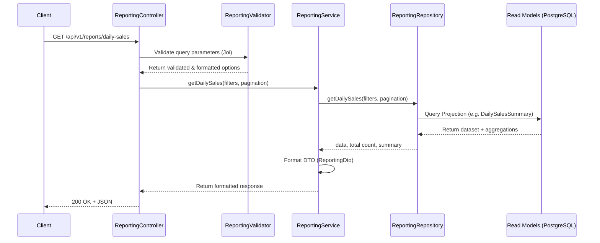

# Reporting Layer Architecture (Sprint 10.4)

## Objective
The Reporting Layer is an Enterprise-grade, read-only query layer that serves formatted data to the presentation layers (Dashboard, Mobile, Export). It strictly reads from the CQRS Projections (Read Models) built during Sprint 10.3 and enforces a zero-business-logic rule to guarantee high-performance retrieval and absolute separation from transactional data.

## CQRS Query Flow
The query side of the CQRS pattern handles data retrieval exclusively.



## Module Structure (Vertical Slice)
All reporting capabilities are isolated in `src/modules/reporting` instead of being spread across horizontal layers.

```
src/modules/reporting/
├── controllers/
│   └── ReportingController.js     # Presentation mapping, standard HTTP response formatting
├── services/
│   └── ReportingService.js        # Orchestration layer, DTO mapping, bridging Controller and Repo
├── repositories/
│   ├── DailySalesReportRepository.js
│   ├── CustomerLedgerReportRepository.js
│   ├── ProductSalesReportRepository.js
│   └── SalesPerformanceReportRepository.js
├── dto/
│   └── reporting.dto.js           # Data transformation objects avoiding direct entity leaks
├── validators/
│   └── reporting.validator.js     # Strict Joi validation schema for all endpoints
└── routes/
    └── reporting.routes.js        # Express routes, Authentication, and OpenAPI schemas
```

## Request Flow
1. **Route Level**: Requests hit `/api/v1/reports/*`. They are immediately checked by standard application authentication middleware.
2. **Controller Level**: Query parameters are validated via Joi.
3. **Service Level**: Business logic is intentionally absent. The service calls the Repository and maps the returned Prisma models to specialized Reporting DTOs.
4. **Repository Level**: Directly queries the `*Summary` projections in PostgreSQL. No joins to transactional tables are permitted.
5. **Response Format**: Guaranteed to conform to the Enterprise structure: `success`, `message`, `data`, `summary`, and `pagination`.

## Pagination & Filtering Strategy
- **Pagination**: All endpoints utilize standard `page` (default: 1) and `limit` (default: 20).
- **Sorting**: Handled natively by Prisma, using the `sort` and `order` query parameters.
- **Filtering**: Filters like `date_from`, `date_to`, `warehouse_id`, and `customer_id` are parsed and applied to Prisma's `where` object dynamically.
- **Aggregation**: Dynamic summaries (e.g. Total Sales, Total Outstanding) are calculated within the Repository using `prisma.*Summary.aggregate` with the exact same filter clause used to fetch the data.

## Security
- Uses the unified `auth.middleware` to secure all endpoints.
- Requires standard JWT tokens.
- Protected against SQL injection by leveraging Prisma Client for all queries.

## Performance Considerations
- **Query Cache Layer**: Responses are automatically cached using an in-memory `QueryCache` (with 60-second TTL) inside the `ReportingService`, drastically reducing database load for dashboards frequently polling the exact same reports. The cache implementation can be seamlessly swapped to Redis for horizontal scalability.
- **No JOINs**: Reading purely from flattened, pre-calculated Read Models.
- **Indexed Access**: Filters rely on indexed fields created during Sprint 10.3 projections.
- **Efficient Pagination**: Uses database-level `OFFSET` and `LIMIT` (Prisma's `skip` and `take`).
- **N+1 Prevention**: By querying flattened models, no nested `include` statements are required, eliminating N+1 completely.
- **Isolated Resource**: Reading from the projections ensures zero contention with high-frequency OLTP operations.
