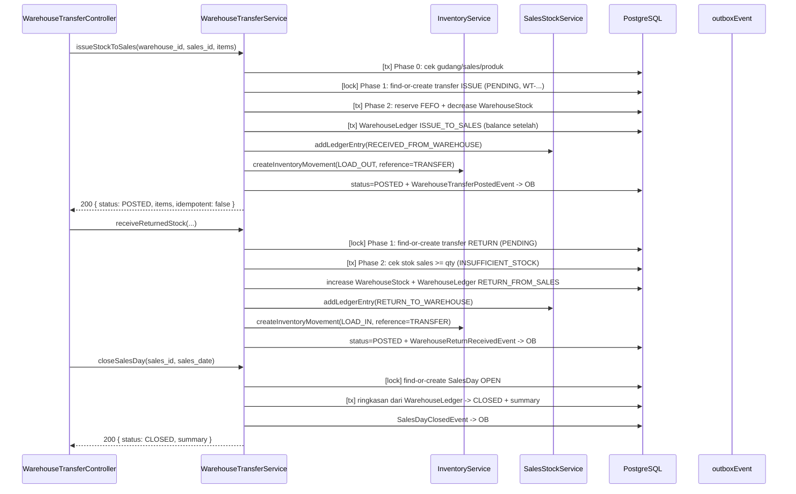

# Warehouse — Transfer Stok Warehouse ⇄ Sales (Sprint 11.2A)

Bounded context **additif** yang menjadikan **Warehouse** sebagai sumber stok perusahaan
untuk mutasi issue/return terhadap *Sales Stock*. Dibangun di atas `v11.1A` yang sudah
frozen; tidak mengubah alur Sales Visit, Outlet Inventory, Stock Count, Auto Sales
Calculation, maupun API yang sudah ada. Semua tabel/enum baru bersifat menambah
(additive/backward-compatible).

Public API:

- `WarehouseTransferService.issueStockToSales()` — Warehouse → Sales
- `WarehouseTransferService.receiveReturnedStock()` — Sales → Warehouse
- `WarehouseTransferService.closeSalesDay()` — checkpoint ringkasan harian sales

## 1. Posisi di Arsitektur

```
Warehouse (bounded context 11.2A)
  ├─ WarehouseStock                 (stok gudang per batch, optimistic version)
  ├─ WarehouseLedger                (source of truth mutasi gudang per produk)
  ├─ WarehouseTransfer(+Item)       (dokumen idempotent issue/return)
  └─ SalesDay                       (ringkasan harian per sales)
            │
            ├─► SalesStockService.addLedgerEntry()   (movement RECEIVED_FROM_WAREHOUSE /
            │                                         RETURN_TO_WAREHOUSE)
            └─► InventoryService (reserveBatchFEFO / decreaseWarehouseStock /
                                  increaseWarehouseStock / createInventoryMovement)
```

- Mutasi **selalu dua sisi dalam satu transaksi**: gudang (WarehouseStock +
  WarehouseLedger) dan sales (SalesStockLedger + SalesStockProjection).
- Ledger gudang bersifat **append-only / immutable**; `balance` = total stok gudang
  produk tsb (sum semua batch) **setelah** mutasi.
- `reference_type` `InventoryMovement` memakai nilai enum `TRANSFER` (nilai baru,
  additive pada `ReferenceType`).

## 2. Model Data

### Enum baru

| Enum | Nilai | Arti |
| --- | --- | --- |
| `WarehouseMovementType` | `ISSUE_TO_SALES`, `RETURN_FROM_SALES` | Mutasi perspektif gudang. |
| `WarehouseTransferType` | `ISSUE`, `RETURN` | Jenis dokumen transfer. |
| `WarehouseTransferStatus` | `PENDING`, `POSTED`, `FAILED` | Status dokumen (`RETRYABLE_STATUSES` = PENDING/FAILED). |
| `SalesDayStatus` | `OPEN`, `CLOSED` | Status ringkasan harian. |

### Nilai baru pada enum global

| Enum | Nilai baru | Efek |
| --- | --- | --- |
| `MovementType` | `RECEIVED_FROM_WAREHOUSE` | Issue → sales: `addLedgerEntry` menambah stok (tidak masuk `DECREASE_TYPES`). |
| `MovementType` | `RESTOCK_OUTLET` | Sales → outlet: `addLedgerEntry` mengurangi stok (ditambahkan ke `DECREASE_TYPES`). |
| `ReferenceType` | `TRANSFER` | `InventoryMovement.reference_type` untuk audit dokumen transfer. |

### `WarehouseLedger`

Kolom kunci: `warehouse_id`, `sales_id`, `product_id`, `movement_type`, `qty`,
`balance`, `reference_type`/`reference_id` (String), `notes`, `created_by`,
`transaction_date`. Append-only.

### `WarehouseTransfer` (+ `WarehouseTransferItem`)

- `transfer_number` unik (`WT-YYYYMMDD-####`, `NumberGeneratorService`).
- Kunci idempotensi `@@unique([type, reference_type, reference_id])`.
- `items` → `WarehouseTransferItem(product_id, qty, batch_id?)`. `batch_id` **wajib**
  untuk `RETURN` (target stok gudang per batch) dan disimpan agar retry idempotent
  memakai dokumen tersimpan tanpa input ulang client; `batch_id` tidak dipakai untuk
  `ISSUE` (stok gudang ditarik FEFO).

### `SalesDay`

- `@@unique([sales_id, sales_date])`; `summary` JSONB berisi ringkasan ledger harian.

## 3. Algoritma `issueStockToSales`

`issueStockToSales({ warehouse_id, sales_id, transaction_date, reference_type, reference_id, notes, items: [{product_id, qty}] })`

```
Phase 0  Validasi prasyarat (transaksi baca, TANPA persistensi)
         - gudang ada   -> WAREHOUSE_NOT_FOUND
         - sales ada    -> SALES_NOT_FOUND
         - produk ada   -> PRODUCT_NOT_FOUND
         - validasi entitas -> 422 (qty integer > 0, tanpa duplikat produk)

Phase 1  Idempotensi (di dalam _withSalesLock)
         - cari dokumen oleh (type=ISSUE, reference_type, reference_id)
         - belum ada      -> buat PENDING + nomor WT-...
         - POSTED         -> kembalikan hasil lama (idempotent: true)
         - PENDING/FAILED -> lanjut post ulang (retry)

Phase 2  Posting (SATU transaksi)
         - per item:
             reserveBatchFEFO + decreaseWarehouseStock (optimistic version)
             WarehouseLedger  ISSUE_TO_SALES  (balance = stok gudang setelah)
             SalesStock       RECEIVED_FROM_WAREHOUSE (addLedgerEntry)
             InventoryMovement LOAD_OUT  (reference_type = TRANSFER)
         - status -> POSTED (posted_at, error_message = null)
         - emit WarehouseTransferPostedEvent (transactional outbox)
         - error? status -> FAILED (error_message max 500), lempar ulang.
```

## 4. Algoritma `receiveReturnedStock`

`receiveReturnedStock({ warehouse_id, sales_id, transaction_date, reference_type, reference_id, notes, items: [{product_id, qty, batch_id}] })`

```
Phase 0  Validasi prasyarat (tanpa persistensi): gudang/sales/produk + entitas
         (batch_id wajib untuk RETURN)

Phase 1  Idempotensi oleh (type=RETURN, reference_type, reference_id)
         - POSTED -> hasil lama (idempotent: true); PENDING/FAILED -> retry

Phase 2  Posting (SATU transaksi)
         - per item:
             cek WarehouseStock batch tsb ada          -> STOCK_NOT_FOUND
             cek SalesStockProjection >= qty           -> INSUFFICIENT_STOCK
             increaseWarehouseStock (optimistic version)
             WarehouseLedger  RETURN_FROM_SALES (balance setelah)
             SalesStock       RETURN_TO_WAREHOUSE (addLedgerEntry)
             InventoryMovement LOAD_IN (reference_type = TRANSFER)
         - status -> POSTED; emit WarehouseReturnReceivedEvent
         - error? status -> FAILED, lempar ulang.
```

Catatan: "return-exceeds" — sales tidak boleh mengembalikan melebihi stok sales yang
ada; diverifikasi di dalam transaksi posting sebelum mutasi.

## 5. Algoritma `closeSalesDay`

`closeSalesDay({ sales_id, sales_date })`

```
- upsert SalesDay OPEN (find-or-create oleh (sales_id, sales_date))
- sudah CLOSED -> kembalikan ringkasan lama (idempotent: true)
- baca WarehouseLedger hari tsb per sales
- ringkasan: total_issue / total_return / net + breakdown per produk
- status -> CLOSED (closed_by, closed_at, summary)
- emit SalesDayClosedEvent (transactional outbox)
```

Tidak memutasi stok; hanya mengunci ringkasan harian sebagai checkpoint.

## 6. Konkurensi & Konsistensi

- **Per-sales async mutex** (`_withSalesLock`) menserialisasi issue/return/close-day
  untuk sales yang sama — mencegah lost-update pada read-modify-write
  `SalesStockProjection` (pola sama dengan `_withWarungLock` 11.0D).
- **Optimistic locking** pada `WarehouseStock` (`UPDATE ... AND version = X` →
  `CONCURRENT_MODIFICATION`) mengamankan decrement/increment lintas warehouse pada
  deployment multi-instance.
- **Idempotency key** `@@unique([type, reference_type, reference_id])` sebagai pengaman
  tingkat DB terhadap double-post.
- **Atomicity**: ledger gudang, ledger/projection sales, InventoryMovement, status
  `POSTED`, dan outbox event commit bersama dalam satu transaksi.
- **Ledger immutable**: tidak ada update/delete baris `WarehouseLedger` setelah ditulis.

## 7. Domain Events

| Event | aggregateType | Dipicu |
| --- | --- | --- |
| `WarehouseTransferPostedEvent` | `WarehouseTransfer` | Issue berhasil di-post. |
| `WarehouseReturnReceivedEvent` | `WarehouseTransfer` | Return berhasil di-post. |
| `SalesDayClosedEvent` | `SalesDay` | SalesDay ditutup. |

Ketiganya didaftarkan di `EventRegistry` dan ditulis ke `outboxEvent` dalam transaksi
posting (transactional outbox).

## 8. API

```
POST /api/v1/warehouse/transfers/issue
     body: { warehouse_id, sales_id, transaction_date?, reference_type, reference_id,
             notes?, items: [{ product_id, qty }] }
     -> 200 { status: "POSTED", transfer_number, items[], idempotent: false }
     -> 409 INSUFFICIENT_STOCK / CONCURRENT_MODIFICATION
     -> 404 WAREHOUSE_NOT_FOUND / SALES_NOT_FOUND / PRODUCT_NOT_FOUND / STOCK_NOT_FOUND
     -> 422 validasi entitas

POST /api/v1/warehouse/transfers/return
     body: { warehouse_id, sales_id, transaction_date?, reference_type, reference_id,
             notes?, items: [{ product_id, qty, batch_id }] }
     -> 200 { status: "POSTED", transfer_number, items[], idempotent: false }
     -> 409 INSUFFICIENT_STOCK (stok sales / stok gudang)
     -> 422 batch_id wajib untuk RETURN

POST /api/v1/warehouse/transfers/sales-days/close
     body: { sales_id, sales_date }
     -> 200 { status: "CLOSED", summary, idempotent }

GET  /api/v1/warehouse/transfers
GET  /api/v1/warehouse/transfers/:id
GET  /api/v1/warehouse/transfers/ledger
GET  /api/v1/warehouse/transfers/sales-days
```

Semua endpoint dilindungi `authMiddleware`.

## 9. Sequence (Issue → Return → Close Day)



## 10. Verifikasi

- `tests/warehouse-transfer.unit.test.js` (11 unit: entitas `WarehouseTransfer`
  (ISSUE/RETURN, batch_id wajib, duplikat/qty/validasi), `SalesDay`, konstanta +
  `RETRYABLE_STATUSES`) — bagian `npm test`.
- `tests/warehouse-transfer.test.js` (10 integrasi: issue, idempotensi, konkuensi
  duplicate issue, insufficient warehouse, return, return idempotent, return-exceeds,
  close-day + idempotent re-close, 422 tanpa batch_id, list/ledger/sales-days) — bagian
  `npm run test:integration`.
- Regresi: `npm test` 65 passing; `npm run test:integration` 57 passing; baseline
  11.0C/11.0D/11.0E/11.1A tetap hijau.
